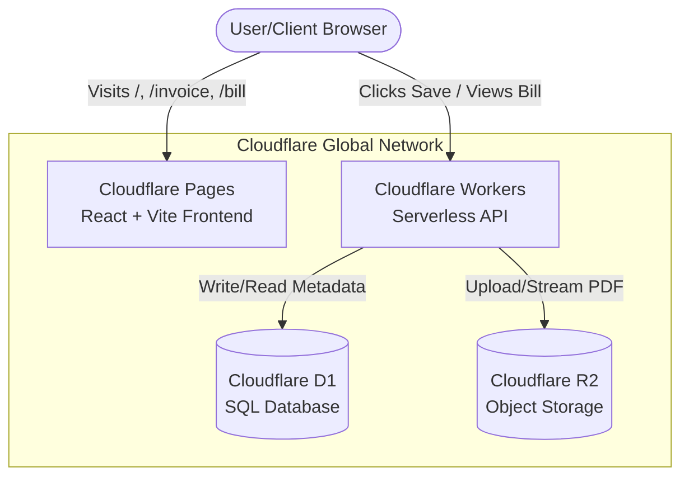

# System Architecture Document

## Overview
The platform leverages a fully serverless edge architecture provided by Cloudflare. This ensures global low latency, zero egress fees for storage, and minimal devops overhead.

## Architecture Diagram (Flow)

## Request Lifecycles

### 1. Generating & Saving an Invoice
1. **Client-side:** React computes the invoice, creates a DOM node.
2. **Client-side:** `html-to-image` and `jsPDF` render the DOM into a PDF Blob in-memory.
3. **Network:** React sends a `POST /api/invoices` request via `fetch()` containing the PDF Blob and form JSON data.
4. **Edge (Worker):** Receives request. Saves PDF Blob to R2 bucket.
5. **Edge (Worker):** Saves metadata (Client name, total, date, R2 Key) to D1 Database.
6. **Network:** Returns success status to React.

### 2. Client Accessing a Bill
1. **Network:** Client clicks link `domain.com/bill/123`.
2. **Client-side:** React loads the Viewer component and fetches `GET /api/invoices/123`.
3. **Edge (Worker):** Queries D1 to verify ID and get R2 Key.
4. **Edge (Worker):** Streams the PDF file directly from R2 back to the user.
5. **Client-side:** Browser renders the PDF natively.
